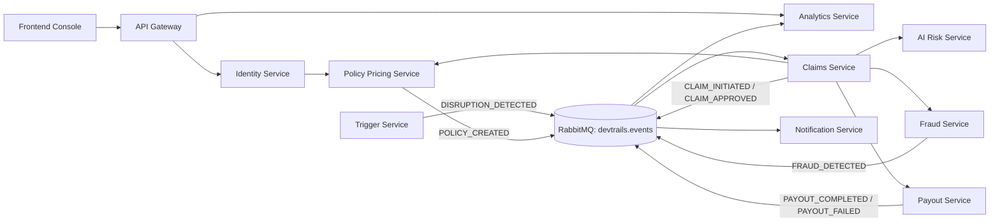
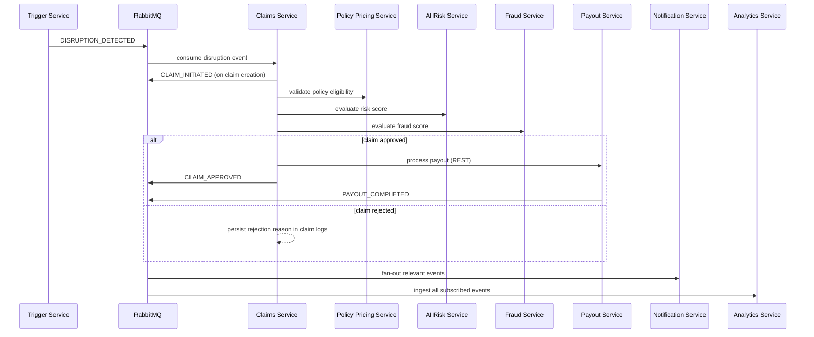

# DEVTrails - Carbon

Production-grade, event-driven microinsurance platform for automated income disruption protection.

This repository contains a full microservice system that detects disruption events, evaluates policy eligibility and AI/fraud risk, processes claims and payouts, and publishes analytics and user notifications. The platform is designed for modular scaling, asynchronous orchestration, and operational transparency.

## Table of Contents

1. [Platform Overview](#platform-overview)
2. [Core Services](#core-services)
3. [Core Features](#core-features)
4. [Microservice Architecture](#microservice-architecture)
5. [Integrations](#integrations)
6. [AI and ML Engineering](#ai-and-ml-engineering)
7. [Data Science Architecture](#data-science-architecture)
8. [DevOps and Operations Guide](#devops-and-operations-guide)
9. [Repository Structure](#repository-structure)
10. [Documentation Index](#documentation-index)

## Platform Overview

Carbon implements an end-to-end insurance automation backend with these capabilities:

- Identity and worker onboarding
- Policy and premium lifecycle management
- Disruption detection and event generation
- Claims decision automation with AI and fraud controls
- Idempotent payout processing with ledger tracking
- Notification fan-out across channels
- Event-driven analytics for dashboards and KPIs

The architecture is intentionally hybrid:

- Synchronous REST for request-time decisions
- Asynchronous AMQP events (RabbitMQ topic exchange) for orchestration and fan-out

This design minimizes tight coupling while preserving deterministic control for mission-critical decision points.

## Core Services

### Service Landscape

| Service | Purpose | Primary Responsibilities | Data Ownership | Contribution to Platform Outcome |
|---|---|---|---|---|
| API Gateway | Unified ingress layer for selected APIs | Proxy, request forwarding, timeout handling, request-id propagation | Stateless | Stable entrypoint for identity and analytics workflows |
| Identity and Worker Service | Authentication and worker profile authority | Register/login/refresh/logout/validate, worker profile CRUD | users, worker_profiles, refresh_tokens, revoked_tokens | Establishes trusted user context and identity for all downstream services |
| Policy and Pricing Service | Policy lifecycle and actuarial pricing | Premium calculation, policy creation, waiting period enforcement, eligibility validation | policies, policy_logs | Determines whether claims are financially and contractually valid |
| Trigger Service | Disruption detection and event emission | Poll weather/traffic/platform signals, classify severity, create disruptions, publish events | disruptions | Converts external conditions into machine-processable insured events |
| Claims Service | Decision orchestration engine | Auto-claim creation, policy validation, AI/fraud checks, approval/rejection, payout trigger | claims, claim_logs | Central decision brain converting events into approved/rejected claims |
| Fraud Service | Fraud risk and override workflows | Fraud scoring, duplicate-pattern checks, audit logs, manual override | fraud_checks, fraud_audit_trail | Protects pool integrity and reduces abusive payouts |
| Payout Service | Financial disbursement and ledgering | Process payout, enforce idempotency, retries, ledger updates, payout events | payouts, ledger | Executes reliable transfer state transitions from approved claims to settlement |
| Notification Service | Outbound communication layer | Send/retry/list notifications, consume platform events, queue-based delivery | notifications | Closes the loop with worker-facing status updates |
| Analytics Service | Metrics and operational intelligence | Consume event stream, deduplicate, aggregate KPIs, expose dashboard/timeseries APIs | analytics_events, analytics_metrics, aggregated_stats | Provides admin observability and business performance intelligence |
| AI Risk Service | Real-time risk intelligence and model operations | Risk scoring, category classification, premium multiplier, drift checks, feedback ingestion | prediction_logs + ML artifacts | Adds predictive intelligence to policy and claim decisions |

### Core API Surface (implemented)

- Identity and Worker:
  - POST /api/v1/auth/register
  - POST /api/v1/auth/login
  - POST /api/v1/auth/refresh
  - POST /api/v1/auth/logout
  - GET /api/v1/auth/validate
  - POST /api/v1/workers/profile
  - GET /api/v1/workers/{user_id}
- Policy and Pricing:
  - POST /api/v1/policy/create
  - GET /api/v1/policy/{user_id}
  - POST /api/v1/policy/validate
  - POST /api/v1/pricing/calculate
- Trigger:
  - POST /api/v1/trigger/mock
  - GET /api/v1/trigger/active
  - POST /api/v1/trigger/stop
- Claims:
  - POST /api/v1/claims/auto
  - GET /api/v1/claims/{user_id}
  - GET /api/v1/claims/detail/{claim_id}
  - POST /api/v1/claims/process
- Fraud:
  - POST /api/v1/fraud/check
  - GET /api/v1/fraud/{claim_id}
  - POST /api/v1/fraud/override
- Payout:
  - POST /api/v1/payout/process
  - GET /api/v1/payout/{user_id}
  - POST /api/v1/payout/retry
- Notification:
  - POST /api/v1/notify/send
  - GET /api/v1/notify/{user_id}
  - POST /api/v1/notify/retry
- Analytics:
  - GET /api/v1/analytics/dashboard
  - GET /api/v1/analytics/zones
  - GET /api/v1/analytics/timeseries
  - GET /api/v1/analytics/health
- AI Risk:
  - POST /api/v1/risk/evaluate
  - GET /api/v1/risk/health
  - GET /api/v1/risk/drift
  - POST /api/v1/risk/feedback
  - GET /api/v1/risk/feedback

## Core Features

### Functional Features

- JWT-secured identity lifecycle with session continuity (access + refresh token pattern)
- Policy issuance with deterministic pricing and waiting period rules
- Real-time disruption event generation from external signal polling and manual triggers
- Automated claim progression from initiation to approval/rejection with full audit logs
- Hybrid decisioning in claims path:
  - policy eligibility (contractual)
  - AI risk score (predictive)
  - fraud score (integrity)
- Idempotency-safe payouts with duplicate protection and ledger traceability
- Event-driven notification fan-out and retryable message delivery
- KPI and zone/time-series analytics derived from event stream ingestion
- API gateway proxying for identity and analytics entrypoints

### Non-Functional Features

- Scalability:
  - stateless API services can be horizontally scaled
  - queue-based asynchronous workers support throughput scaling
- Modularity:
  - clear bounded contexts and database-per-service ownership
  - isolated deployments with service-specific Dockerfiles and migrations
- Fault tolerance:
  - durable queues/exchanges
  - retry and dead-letter queue patterns in event consumers
  - idempotent payout processing
- Performance:
  - caching in analytics endpoints
  - async IO for HTTP integrations and gateway proxying
  - queue prefetch and retry tuning
- Maintainability:
  - standardized response envelope
  - environment-driven configuration
  - Alembic migrations and per-service test suites
- Observability:
  - /health endpoints across services
  - /metrics (Prometheus) on core backend services
  - structured logging with request correlation via X-Request-ID
- Security:
  - Bearer JWT on protected routes
  - role-aware access checks
  - optional HTTPS enforcement via configuration

## Microservice Architecture

### Functional Architecture



### Decision Workflow (Disruption to Settlement)



### Non-Functional Architecture Characteristics

- Scalability by decomposition:
  - each service scales independently by workload profile
  - analytics and notification can scale consumers separately from API replicas
- Flexibility by hybrid communication:
  - REST for low-latency deterministic interactions
  - AMQP for decoupled, eventually consistent workflows
- Reliability by replay and isolation:
  - retries with bounded limits
  - dead-letter queues for poison message isolation
  - deduplication in analytics and idempotency in payouts
- Maintainability by contract consistency:
  - common response contract: status, data, error
  - shared event naming conventions and routing keys
  - migration-first schema evolution with Alembic

## Integrations

### Communication Protocols

- REST/HTTP: synchronous service-to-service and client-to-service interactions
- AMQP (RabbitMQ topic exchange): asynchronous event choreography
- Redis:
  - cache support (analytics)
  - queue backend/buffering for notification worker patterns
- Celery: asynchronous notification task execution

There is no gRPC dependency in the current implementation.

### Internal Service Dependencies (synchronous)

| Caller | Callee | Purpose |
|---|---|---|
| API Gateway | Identity Service | Proxy auth and worker profile paths |
| API Gateway | Analytics Service | Proxy analytics paths |
| Claims Service | Policy Pricing Service | Claim eligibility validation |
| Claims Service | AI Risk Service | Risk scoring for claim decision |
| Claims Service | Fraud Service | Fraud check before approval |
| Claims Service | Payout Service | Trigger payout on approved claim |
| Policy Pricing Service | AI Risk / Fraud / Identity / Claims (integration-ready paths) | Enrichment and validation hooks |
| Fraud Service | Identity Service / AI Risk Service | Additional fraud context |

### Event Contracts and Routing Keys

| Event Type | Routing Key | Producer | Primary Consumers |
|---|---|---|---|
| DISRUPTION_DETECTED | trigger.disruption_detected | Trigger Service | Claims, Analytics, Notification |
| CLAIM_INITIATED | claim.initiated | Claims Service | Fraud, Analytics, Notification |
| CLAIM_APPROVED | claim.approved | Claims Service | Payout, Analytics, Notification |
| FRAUD_DETECTED | fraud.detected | Fraud Service | Analytics, Notification |
| PAYOUT_COMPLETED | payout.completed | Payout Service | Analytics, Notification |
| PAYOUT_FAILED | payout.failed | Payout Service | Analytics, Notification |
| POLICY_CREATED | policy.policy_created (pattern: policy.<event_type>) | Policy Pricing Service | Analytics, Notification |

### External Integrations

| Integration | Service | Role |
|---|---|---|
| Open-Meteo API | Trigger Service | Rainfall signal for disruption detection |
| Traffic API (configurable) | Trigger Service | Congestion ratio signal |
| Platform status API (configurable) | Trigger Service | Platform outage signal |
| Payment provider abstraction (mock/real adapters) | Payout Service | Payout execution layer |
| SMS/Push provider keys | Notification Service | Outbound communication channels |

## AI and ML Engineering

### AI Risk Runtime Model

The AI Risk Service uses a hybrid inference strategy:

- ML core: RandomForestRegressor on engineered disruption/behavior features
- Rule layer: deterministic weighted scoring for explainable controls
- Final score: 70% adjusted ML prediction + 30% rule score

Output payload includes:

- risk_score (0-1)
- risk_category (LOW/MEDIUM/HIGH)
- premium_multiplier
- confidence
- top_factors
- prediction_id for review loop tracking

### Why These Algorithms

- RandomForestRegressor:
  - robust for nonlinear interactions
  - stable on mixed engineered features
  - strong practical baseline with low tuning fragility
- Deterministic rule layer:
  - auditable business alignment
  - behavior guardrails under distribution shifts
  - explicit weighting for key risk drivers

### Feature Engineering

Model feature set includes base, engineered, and temporal features:

- Base: disruption_freq, duration, traffic, order_drop, activity, claims
- Engineered: disruption_traffic_interaction, exposure_index, resilience_gap
- Temporal: rolling_disruption_3h, traffic_lag_1, previous_risk_score, risk_trend_1h

### Training and Evaluation Pipeline

Pipeline stages (implemented in ml/src):

1. Synthetic scenario data generation
2. Optional HITL feedback dataset merge
3. Preprocessing and feature construction
4. Train/test split with stratification by risk category
5. Cross-validation and fit diagnostics
6. Feature-importance validation checks
7. Artifact registration and active model update

Current benchmark snapshot (from ml/models/metadata.json):

- Test MAE: 0.02167
- Test RMSE: 0.02793
- Test R2: 0.98526
- Test Accuracy (derived categories): 0.93500
- Fit quality: balanced

### MLOps and Deployment Behavior

- Artifact paths:
  - Active bundle: backend/services/ai-risk-service/ml/models/risk_model_v1.pkl
  - Registry: backend/services/ai-risk-service/ml/models/model_registry.json
  - Metadata: backend/services/ai-risk-service/ml/models/metadata.json
- Runtime APIs:
  - evaluate, health, drift, feedback
- Human-in-the-loop:
  - prediction logging in prediction_logs
  - reviewed feedback ingestion for retraining
- Operational resilience:
  - fallback model path when artifact loading fails
  - drift reporting based on live-vs-baseline feature statistics

## Data Science Architecture

### Data Generation and Ingestion

- Synthetic data generation for model training simulates correlated risk scenarios.
- Optional labeled feedback data enriches training data to incorporate human corrections.
- Event ingestion pipeline consumes operational events from RabbitMQ into analytics storage.

### Processing and ETL Flow

Analytics ingestion service performs:

1. Event envelope normalization (event_type/payload/timestamp)
2. Event deduplication via deterministic event keys
3. Metric derivation (claims, payouts, fraud counts, risk counters, premium totals)
4. Aggregated-stat updates for dashboard reads
5. Cache invalidation to keep API reads consistent with latest events

### Data Storage Architecture

- Online transactional stores: PostgreSQL per service (database-per-service model)
- Event stream: RabbitMQ durable topic exchange
- Queue/backend/cache support: Redis where applicable
- ML artifacts and QA outputs: ai-risk-service/ml/models

### Analytical Workflows

- Dashboard KPI aggregation (system-level metrics)
- Zone-level risk and volume aggregation
- Time-series reporting with configurable lookback windows
- AI model quality reporting with generated visualization assets:
  - backend/services/ai-risk-service/ml/models/reports/predicted_vs_actual_test.png
  - backend/services/ai-risk-service/ml/models/reports/residual_distribution_test.png
  - backend/services/ai-risk-service/ml/models/reports/feature_importance_top12.png
  - backend/services/ai-risk-service/ml/models/reports/metric_summary_train_test.png

### Scalability and Flexibility in Data Layer

- Producer/consumer decoupling isolates upstream API latency from downstream analytics work.
- Queue-based ingestion allows horizontal scaling of consumers under event bursts.
- Service-local schemas preserve ownership boundaries and simplify independent evolution.
- Model registry approach supports safe artifact versioning and controlled roll-forward.

## DevOps and Operations Guide

### Runtime Prerequisites

- Docker and Docker Compose
- Python 3.11+ for local service runs

### Local Full-Stack Run (recommended)

```bash
cd backend
docker compose up -d --build
```

Core runtime endpoints:

- Frontend console: http://localhost:5500
- API Gateway: http://localhost:8001
- Swagger docs are available on each service at /docs

Stop stack:

```bash
cd backend
docker compose down
```

### Service Port Map (docker-compose)

| Component | Host Port | Container Port |
|---|---:|---:|
| api-gateway | 8001 | 8000 |
| identity-service | 8005 | 8000 |
| policy-pricing-service | 8004 | 8000 |
| ai-risk-service | 8003 | 8000 |
| trigger-service | 8008 | 8000 |
| claims-service | 8009 | 8000 |
| fraud-service | 8010 | 8000 |
| payout-service | 8007 | 8000 |
| notification-service | 8006 | 8000 |
| analytics-service | 8011 | 8000 |
| frontend-console | 5500 | 80 |

Datastores and broker ports are defined in backend/docker-compose.yml.

### Health, Metrics, and Tracing

- All services expose /health
- Prometheus /metrics implemented on core backend services:
  - policy-pricing
  - trigger
  - claims
  - fraud
  - payout
  - analytics
- X-Request-ID propagated across gateway and service boundaries for traceability

### Testing Strategy

Implemented test layers include:

- Unit tests (service logic)
- Integration tests (inter-service contracts and flows)
- API route tests
- Performance/stress tests with Locust in multiple services

Examples:

```bash
# Service-level tests
cd backend/services/claims-service
pytest -q

# Gateway proxy tests
cd backend/api-gateway
pytest -q
```

### Deployment and Environment Notes

- Service configuration is environment-driven via .env/.env.example files.
- Each service owns its migration lifecycle through Alembic.
- Startup scripts and Docker entrypoints in each service enforce migration/run patterns.
- Additional infrastructure assets are available under backend/infrastructure:
  - docker (dev/prod compose)
  - monitoring (Prometheus/Grafana)
  - nginx
  - scripts

## Repository Structure

```text
backend/
  api-gateway/
  services/
    ai-risk-service/
    analytics-service/
    claims-service/
    fraud-service/
    identity-service/
    notification-service/
    payout-service/
    policy-pricing-service/
    trigger-service/
  shared/
  infrastructure/
  tests/
```

Carbon is designed as a robust, evolvable microservice platform where domain services remain independently deployable, while event choreography and predictive intelligence work together to automate claims outcomes at production scale.
